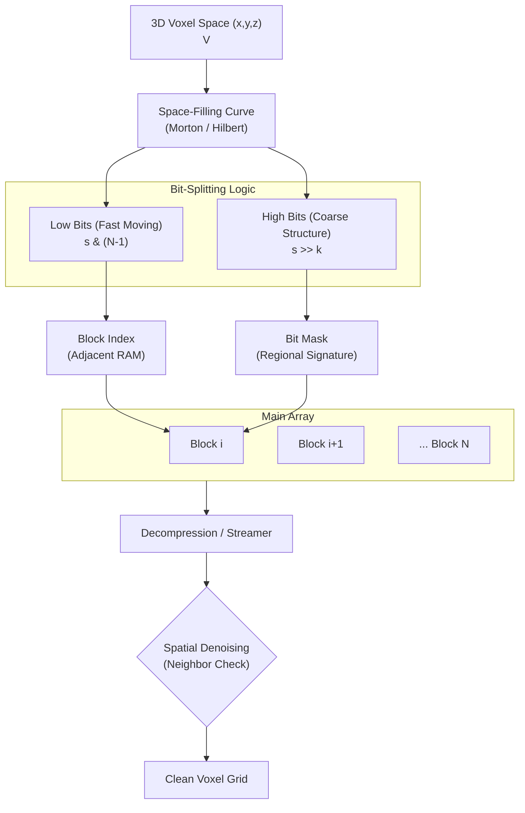

# Proposal: Spatial-Blocked Bloom Filters (SBBF) for Voxel Data

**Author:** Moritz Laass
**Date:** December 20, 2025
**Subject:** High-Performance Voxel Membership Queries using Space-Filling Curves and Blocked Bloom Filters

## 1. Abstract

Traditional Bloom filters use cryptographic hash functions to distribute elements across a bit vector, intentionally destroying locality. For 3D voxel data, spatial locality is a critical feature that can be exploited for performance. We propose the Spatial-Blocked Bloom Filter (SBBF). Unlike traditional filters, we map 3D coordinates $(x, y, z)$ to memory blocks using the low-order bits of a Space-Filling Curve ($SFC$). This ensures that spatial neighbors fall into adjacent memory blocks, maximizing hardware prefetching efficiency. Simultaneously, we use the high-order bits to derive bit-masks, providing a "structural signature" that reduces collisions. Crucially, the topological preservation of the SBBF allows for Streaming Spatial Denoising, where false positives are identified and discarded based on neighbor consensus during reconstruction.

## 2. Architectural Design

### 2.1 Locality-Preserving Block Mapping

In this architecture, we prioritize memory throughput by ensuring that moving through 3D space translates to a linear or near-linear walk through memory. We utilize the low-order bits of the $SFC$ for block indexing:

$$block\_idx = SFC(x, y, z) \pmod{N}$$

Where $N$ is the number of blocks. Because the low bits of an $SFC$ (like a Morton/Z-curve) change with every unit step in 3D space, spatial neighbors are mapped to $Block_i, Block_{i+1}, \dots$. This allows the CPU to leverage L1/L2 prefetching during neighborhood searches and volume traversals.

### 2.2 Structural Intra-Block Membership

The bit-mask within a block (typically 64 or 256 bits) is derived from the "coarser" high-order bits of the $SFC$.

- **Bit Pattern:** $m = f(SFC_{\text{high}}) \pmod{M}$, where $M$ is the register size.
- **Advantage:** Since high bits represent coarse regional volumes, they act as a unique signature for that region. This "spatial hashing" prevents local clusters from saturating a single bit index.

## 3. Conceptual Diagram



## 4. Pseudo-code Implementation

```cpp
struct SpatialBlockedBloomFilter {
    uint64_t* blocks;
    size_t num_blocks;
    uint32_t block_mask;
    int k;

    void GetLocation(uint64_t sfc, uint64_t& idx, uint64_t& mask) {
        idx = sfc & block_mask;
        uint64_t coarse = sfc >> k;
        mask = (1ULL << (coarse % 64));
    }

    bool RawQuery(uint64_t sfc) {
        uint64_t idx, mask;
        GetLocation(sfc, idx, mask);
        return (blocks[idx] & mask) == mask;
    }
};
```

## 5. Spatial Denoising & False Positive Mitigation

A unique advantage of the SBBF is the ability to perform Topological Verification. In a standard Bloom filter, a false positive is indistinguishable from a true positive. In SBBF, because the mapping is spatial, we can apply a heuristic: True voxels are likely to have neighbors; False Positives are likely to be isolated "speckles".

### 5.1 Streaming Neighborhood Consensus

When reconstructing the voxel grid by iterating along the $SFC$, we can maintain a small sliding window of previously queried results. For a voxel $V_i$ at $SFC(i)$, we define a consensus function $C(V_i)$:

$$C(V_i) = Query(V_i) \land (CountNeighbors(V_i) > \tau)$$

Where $\tau$ is a density threshold. If $\tau = 0$, a voxel is discarded if it has zero neighbors in its immediate 3D Moore neighborhood.

### 5.2 Streaming Pseudo-code

By iterating in SFC order, many "neighbors" in 3D space are also "neighbors" in the 1D stream, allowing for extremely fast lookups.

```cpp
void DecompressAndDenoise(SpatialBlockedBloomFilter& sbbf, size_t max_sfc) {
    // A sliding window/cache of query results to avoid redundant SBBF lookups
    // For Morton curves, a small bitset or ring buffer works well.
    for (uint64_t sfc = 0; sfc < max_sfc; ++sfc) {
        if (!sbbf.RawQuery(sfc)) continue;

        // Potential Voxel found. Perform Neighborhood Consensus.
        int neighbors = 0;
        for (auto& offset : GetSpatialNeighbors(sfc)) {
            if (sbbf.RawQuery(sfc + offset)) {
                neighbors++;
            }
        }

        // Denoising Heuristic:
        // Real geometry (walls, terrain) has high connectivity.
        // False Positives are statistically isolated.
        if (neighbors >= 1) {
            EmitVoxel(sfc);
        } else {
            // Discarded as False Positive "Speckle"
        }
    }
}
```

## 6. Advantages & Analysis

- **Hardware Prefetching:** Low-bit indexing ensures linear memory walks.
- **In-Stream Denoising:** High-speed false positive mitigation using spatial connectivity heuristics.
- **Deterministic Collisions:** Collisions are regional, making "noise" predictable and easier to filter with morphological operators (dilation/erosion).
- **SIMD Compatibility:** Branchless bit-splitting and parallel neighbor checking via vector registers.

## 7. References

- [Putze09] Putze, Sanders, Singler: Cache-, Hash-, and Space-Efficient Bloom Filters. ACM JEA, 2009.
- [Morton66] Morton, G. M.: A Computer Oriented Geodetic Data Base. IBM, 1966.
- [Ujang14] Ujang et al.: 3D Hilbert Space Filling Curves in 3D City Modeling for Faster Spatial Queries.