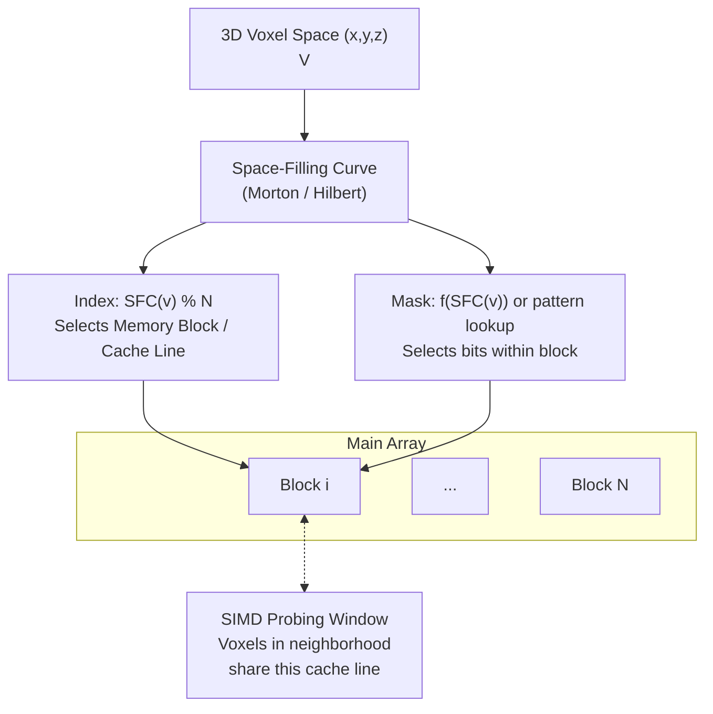

# Proposal: Spatial-Blocked Bloom Filters (SBBF) for Voxel Data

**Author:** Moritz Laass
**Date:** December 20, 2025
**Subject:** High-Performance Voxel Membership Queries using Space-Filling Curves and Blocked Bloom Filters

## Abstract

Traditional Bloom filters use cryptographic or uniform hash functions to distribute elements across a bit vector, intentionally destroying locality to minimize collisions. However, for 3D voxel data, spatial locality is a feature, not a bug. We propose the Spatial-Blocked Bloom Filter (SBBF). By replacing the standard hash-based block indexing with a Space-Filling Curve ($SFC$) (e.g., Morton/Z-order or Hilbert), we map 3D coordinates $(x, y, z)$ to specific blocks in a contiguous array. This approach maintains cache locality for neighborhood queries, enables efficient SIMD-accelerated probing, and allows for predictive cache preloading during full-volume traversal.

## 2. Architectural Design

### 2.1 Spatial Block Mapping

Instead of `block_idx = hash(v) % num_blocks`, we utilize:

$$block\_idx = SFC(x, y, z) \pmod{N}$$

Where $N$ is the number of blocks. Because SFCs map multidimensional data to 1D while preserving proximity, voxels that are neighbors in 3D space are highly likely to reside in the same or adjacent memory blocks.

### 2.2 Intra-Block Membership

Each block is a Register-Blocked Bloom Filter (typically  register size  or cachline size (usually multiples of 64 bits on modern systems)).

- **Block Selection:** Determined by the SFC value mapped to the range of available blocks $[0, N-1]$.
- **Bit Pattern:** Multiple strategies will be explored, inspired by SIMD-optimized Bloom filters [Putze09]:
  - *Direct derivation:* $m = f(SFC(v)) \pmod{M}$, where $M$ is the register size.
  - *Precomputed patterns (pat):* Lookup table of k-bit patterns indexed by SFC value, enabling SIMD vectorization.
  - *Multiplexed patterns (pat[x]):* OR-ing x patterns with k/x bits each for better FPR with smaller tables.

### 2.3

### Conceptual Diagram 3D


## 4. Pseudo-code Implementation

```C
struct SpatialBlockedBloomFilter {
    uint64_t* blocks;
    size_t num_blocks;

    // Maps 3D coordinates to a 1D curve value
    uint64_t GetSFCValue(int x, int y, int z) {
        return MortonCode3D(x, y, z); // or Hilbert
    }

    // Identify the block and the internal bit mask
    void GetLocation(uint64_t sfc, uint64_t& block_idx, uint64_t& mask) {
        // Use modulo for generalized indexing when N is not a power of 2
        block_idx = sfc % num_blocks;

        // Derive bit position. Using a permutation or shift
        // helps decorrelate the block index from the bit mask.
        uint64_t internal_pos = (sfc >> 10) % 64;
        mask = (1ULL << internal_pos);
    }

    void Insert(int x, int y, int z) {
        uint64_t sfc = GetSFCValue(x, y, z);
        uint64_t idx, mask;
        GetLocation(sfc, idx, mask);
        blocks[idx] |= mask;
    }

    bool Query(int x, int y, int z) {
        uint64_t sfc = GetSFCValue(x, y, z);
        uint64_t idx, mask;
        GetLocation(sfc, idx, mask);
        return (blocks[idx] & mask) == mask;
    }

    // Neighborhood Query: Optimized for locality
    bool QueryNeighborhood(int x, int y, int z) {
        uint64_t center_sfc = GetSFCValue(x, y, z);
        uint64_t idx = center_sfc % num_blocks;

        // Pre-fetch the block once for all neighbors
        uint64_t cached_block = blocks[idx];

        // Check neighbors (simplified logic)
        // Many will resolve to the same 'cached_block'
        // resulting in 0 additional cache misses.
        ...
    }
};
```

## 5. Advantages & Analysis
1. **Cache Efficiency**: For spatial queries (e.g., "Is there a voxel within radius $R$ of $P$?"), the SFC ensures that the necessary bits are packed into very few cache lines. A standard hash-based Bloom filter would incur a cache miss for every single neighbor check.

2. **Predictive Preloading:** During a linear scan of the voxel volume (e.g., for decompression or rendering), the SFC generates a predictable memory access pattern, allowing the CPU hardware prefetcher to load subsequent blocks into L1/L2 cache before they are queried.

3. **No Hash Overhead:** Mapping functions like Morton codes can be implemented with simple bit-interleaving instructions (PDEP on x86), which are significantly faster than even the simplest MurmurHash or CityHash.

4. **Deterministic Collisions:** Unlike random hashes, collisions in SBBF are spatially deterministic. This can be exploited to handle specific LOD (Level of Detail) scenarios where a "False Positive" actually represents a nearby occupied voxel, which might be acceptable for collision culling or visibility testing.

## 6. References

- [Putze09] Putze, Sanders, Singler: Cache-, Hash-, and Space-Efficient Bloom Filters. ACM JEA, 2009.
- [Lang19] Lang et al.: Performance-Optimal Filtering: Bloom Overtakes Cuckoo at High Throughput. PVLDB, 2019.
- [Chen22] Chen et al.: Efficient Point Cloud Analysis Using Hilbert Curve (HilbertNet). ECCV, 2022.
- [Jia22] Jia et al.: Efficient 3D Hilbert Curve Encoding and Decoding Algorithms. Chinese J. of Electronics, 2022.
- [Ujang14] Ujang et al.: 3D Hilbert Space Filling Curves in 3D City Modeling for Faster Spatial Queries. Int. J. 3-D Info. Modeling, 2014.
- [Morton66] Morton, G. M.: A Computer Oriented Geodetic Data Base and a New Technique in File Sequencing. IBM, 1966.