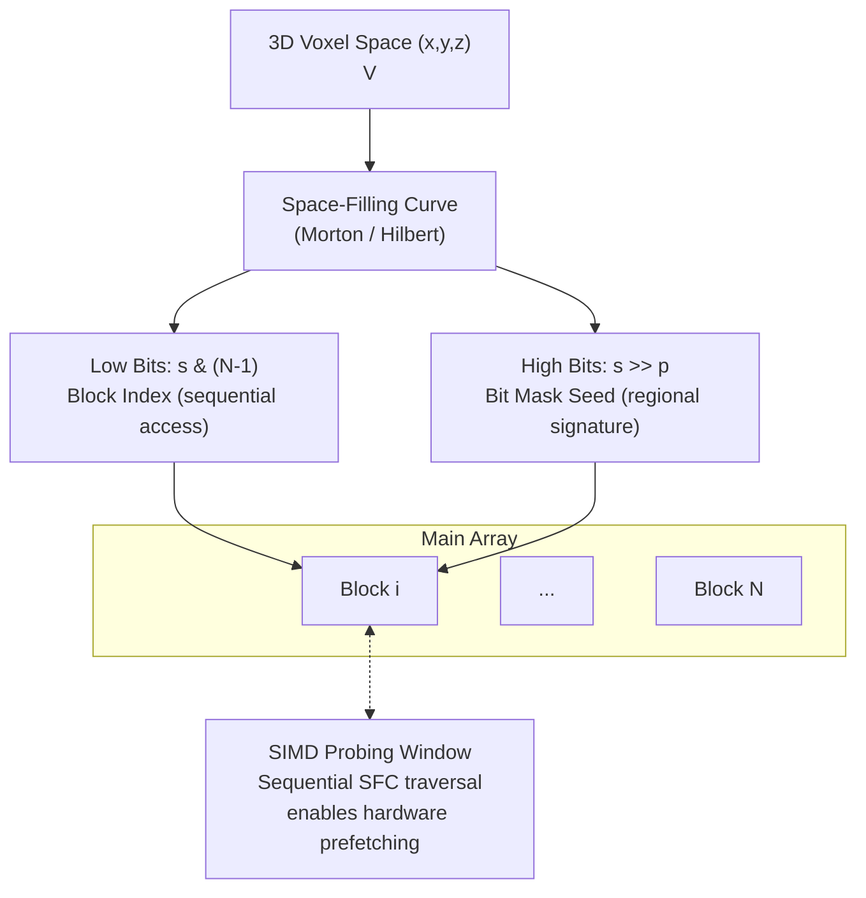
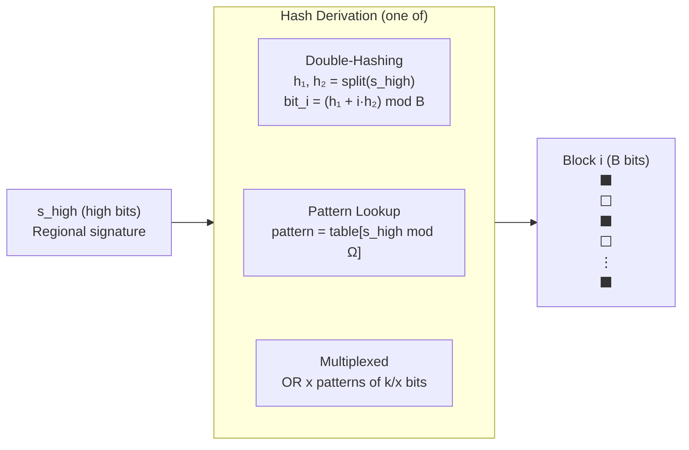

# Proposal: Spatial-Blocked Bloom Filters (SBBF) for Voxel Data

**Author:** Moritz Laass
**Date:** December 20, 2025
**Subject:** High-Performance Voxel Membership Queries using Space-Filling Curves and Blocked Bloom Filters

## Abstract

Traditional Bloom filters use cryptographic or uniform hash functions to distribute elements across a bit vector, intentionally destroying locality to minimize collisions. However, for 3D voxel data, spatial locality is a feature, not a bug. We propose the Spatial-Blocked Bloom Filter (SBBF). By replacing the standard hash-based block indexing with a Space-Filling Curve ($SFC$) (e.g., Morton/Z-order or Hilbert), we map 3D coordinates $(x, y, z)$ to specific blocks in a contiguous array. This approach maintains cache locality for neighborhood queries, enables efficient SIMD-accelerated probing, and allows for predictive cache preloading during full-volume traversal.

## 2. Architectural Design

### 2.1 Spatial Block Mapping

Instead of `block_idx = hash(v) % num_blocks`, we utilize:

$$block\_idx = SFC(x, y, z) \pmod{N}$$

Where $N$ is the number of blocks. Because SFCs map multidimensional data to 1D while preserving proximity, voxels that are neighbors in 3D space are highly likely to reside in the same or adjacent memory blocks.

### 2.2 Intra-Block Membership

Each block is a Bloom filter of $B$ bits (typically register size 64 bits, or cache-line size 512 bits). Within each block, $k$ bits are set per element, where $k$ is the number of hash functions.

- **Block Selection:** Determined by the SFC value mapped to the range of available blocks $[0, N-1]$.
- **Intra-Block Hashing:** The $k$ bit positions within a block can be derived via multiple strategies, inspired by SIMD-optimized Bloom filters [Putze09, Lang19]:
  - *Direct derivation:* Generate $k$ positions from SFC bits using double-hashing: $h_i = (h_1 + i \cdot h_2) \mod B$.
  - *Precomputed patterns (pat):* Lookup table of $\Omega$ precomputed $k$-bit patterns, indexed by SFC value, enabling SIMD vectorization.
  - *Multiplexed patterns (pat[x]):* OR-ing $x$ patterns with $k/x$ bits each for better FPR with smaller tables.

### 2.3 Bit-Splitting for Index Derivation

Rather than using modulo operations, we exploit the structure of the SFC value directly by splitting it into disjoint bit ranges. Given an SFC value $s = SFC(x, y, z)$, we partition its bits into two components:

$$s = s_{\text{high}} \cdot 2^p + s_{\text{low}}$$

where $p$ is the number of low bits used for block indexing. **Crucially, we use low bits for block selection and high bits for the bit mask:**

- **Block index:** $\text{block\_idx} = s_{\text{low}} = s \mod 2^p$
- **Bit mask seed:** $s_{\text{high}} = \lfloor s / 2^p \rfloor$ (used to derive $k$ bit positions)

**Why low bits for block index?** The low-order bits of an SFC (like Morton/Z-curve) change with every unit step in 3D space. This means spatial neighbors map to $Block_i, Block_{i+1}, \dots$, enabling the CPU to leverage L1/L2 prefetching during neighborhood searches and volume traversals.

**Why high bits for bit mask?** The high-order bits represent coarse regional volumes. Using them as a "structural signature" prevents local clusters from saturating a single bit index — spatially close voxels share the same block but have different bit patterns.

**Choosing the split point.** For $N = 2^p$ blocks, we use $p$ low bits for block indexing:

$$N = 2^p, \quad p \in \mathbb{N}$$

The remaining high bits form the bit mask seed. For a block of $B$ bits and $k$ hash functions:

$$\text{mask} = f(s_{\text{high}}) \pmod{B}$$

Or using double-hashing to derive $k$ positions from the high bits:

$$h_1 = s_{\text{high}} \mod B, \quad h_2 = \lfloor s_{\text{high}} / B \rfloor \mod B$$
$$\text{bit}_i = (h_1 + i \cdot h_2) \mod B, \quad i \in [1, k]$$

**Example.** With $N = 2^{10} = 1024$ blocks ($p = 10$) and $B = 64$-bit registers:
- Low bits: $p = 10$ bits for block index (sequential memory access)
- High bits: remaining bits for bit mask derivation (regional signature)
- For a 32-bit SFC value: bits $[0, 9]$ → block index, bits $[10, 31]$ → bit mask seed

This approach ensures linear memory walks through 3D space:

```c
block_idx = sfc & ((1 << p) - 1);          // Extract low bits → block index
uint32_t coarse = sfc >> p;                // Extract high bits → mask seed
uint32_t h1 = coarse % B;                  // First hash
uint32_t h2 = (coarse / B) % B;            // Second hash
for (int i = 1; i <= k; i++)
    set_bit(block[block_idx], (h1 + i * h2) % B);
```

### Conceptual Diagram 3D


### Intra-Block Hashing Detail


## 4. Pseudo-code Implementation

```C
struct SpatialBlockedBloomFilter {
    uint64_t* blocks;      // Array of N blocks, each B bits
    size_t N;              // Number of blocks (must be 2^p)
    int p;                 // log2(N) - bits for block index
    int k;                 // Number of hash functions per element
    int B;                 // Block size in bits (e.g., 64)
 // Derive block index (low bits) and k bit positions (from high bits)
    void GetLocation(uint64_t sfc, uint64_t& block_idx, uint64_t& mask) {
        // Low bits → block index (sequential memory access)
        block_idx = sfc & (N - 1);

        // High bits → regional signature for k-bit mask
        uint64_t coarse = sfc >> p;
        uint64_t h1 = coarse % B;
        uint64_t h2 = (coarse / B) % B;
        if (h2 == 0) h2 = 1;  // Ensure h2 != 0 for double-hashing

        mask = 0;
        for (int i = 1; i <= k; i++) {
            mask |= (1ULL << ((h1 + i * h2) % B));
        }
    }

    void Insert(int x, int y, int z) {
        uint64_t sfc = SFC(x, y, z);
        uint64_t idx, mask;
        GetLocation(sfc, idx, mask);
        blocks[idx] |= mask;
    }

    bool Query(int x, int y, int z) {
        uint64_t sfc = SFC(x, y, z);
        uint64_t idx, mask;
        GetLocation(sfc, idx, mask);
        return (blocks[idx] & mask) == mask;
    }

    // Streaming traversal: iterate in SFC order for sequential block access
    void StreamingScan(size_t max_sfc) {
        for (uint64_t sfc = 0; sfc < max_sfc; ++sfc) {
            uint64_t idx, mask;
            GetLocation(sfc, idx, mask);
            // Sequential sfc values → sequential block indices
            // Hardware prefetcher loads blocks[idx+1], blocks[idx+2], ...
            if ((blocks[idx] & mask) == mask) {
                EmitCandidate(sfc);
            }
        }
    }
};
```

## 5. Spatial Denoising & False Positive Mitigation

A unique advantage of the SBBF is the ability to perform **Topological Verification**. In a standard Bloom filter, a false positive is indistinguishable from a true positive. In SBBF, because the mapping is spatial, we can apply a heuristic: true voxels are likely to have neighbors; false positives are likely to be isolated "speckles".

### 5.1 Streaming Neighborhood Consensus

When reconstructing the voxel grid by iterating along the $SFC$, we maintain a sliding window of previously queried results. For a voxel $V_i$ at $SFC(i)$, we define a consensus function:

$$C(V_i) = Query(V_i) \land (CountNeighbors(V_i) > \tau)$$

Where $\tau$ is a density threshold. If $\tau = 0$, a voxel is discarded if it has zero neighbors in its immediate 3D Moore neighborhood.

### 5.2 Denoising Pseudo-code

By iterating in SFC order, many "neighbors" in 3D space are also "neighbors" in the 1D stream, enabling fast lookups with minimal cache misses.

```cpp
void DecompressAndDenoise(SpatialBlockedBloomFilter& sbbf, size_t max_sfc) {
    // Sliding window cache of query results (ring buffer for Morton curves)
    for (uint64_t sfc = 0; sfc < max_sfc; ++sfc) {
        if (!sbbf.Query(sfc)) continue;

        // Potential voxel found — perform neighborhood consensus
        int neighbors = 0;
        for (auto& offset : GetSpatialNeighborOffsets()) {
            if (sbbf.Query(sfc + offset)) {
                neighbors++;
            }
        }

        // Denoising heuristic: real geometry has high connectivity,
        // false positives are statistically isolated
        if (neighbors >= 1) {
            EmitVoxel(sfc);
        }
        // else: discarded as false positive "speckle"
    }
}
```

## 6. Advantages & Analysis

- **Hardware Prefetching:** Low-bit block indexing ensures linear memory walks during SFC traversal.
- **In-Stream Denoising:** High-speed false positive mitigation using spatial connectivity heuristics.
- **No Hash Overhead:** Morton codes use simple bit-interleaving (PDEP on x86), faster than MurmurHash/CityHash.
- **Deterministic Collisions:** Collisions are regional, making "noise" predictable and filterable with morphological operators (dilation/erosion).
- **SIMD Compatibility:** Branchless bit-splitting and parallel neighbor checking via vector registers.

## 7. References

- [Putze09] Putze, Sanders, Singler: Cache-, Hash-, and Space-Efficient Bloom Filters. ACM JEA, 2009.
- [Lang19] Lang et al.: Performance-Optimal Filtering: Bloom Overtakes Cuckoo at High Throughput. PVLDB, 2019.
- [Chen22] Chen et al.: Efficient Point Cloud Analysis Using Hilbert Curve (HilbertNet). ECCV, 2022.
- [Jia22] Jia et al.: Efficient 3D Hilbert Curve Encoding and Decoding Algorithms. Chinese J. of Electronics, 2022.
- [Ujang14] Ujang et al.: 3D Hilbert Space Filling Curves in 3D City Modeling for Faster Spatial Queries. Int. J. 3-D Info. Modeling, 2014.
- [Morton66] Morton, G. M.: A Computer Oriented Geodetic Data Base and a New Technique in File Sequencing. IBM, 1966.